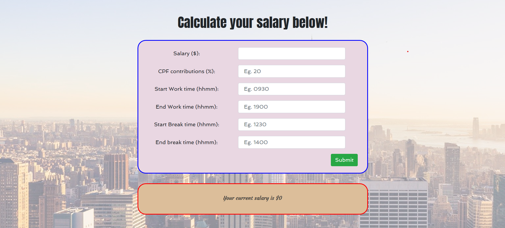

# Salary-meter

A simple web dashboard for computing current salary earned in the month

### Usage

1. Clone repository to local directory
2. `npm install` to install all dependencies
3. `pip install flask` and `pip install flask_cors` to get both packages
4. `npm run app` to run app under localhost:3000
5. Fill in information and you are ready to go!

### Background Information

1. Salary updates every minute.
2. The salary will only update on **working days**, meaning instead of dividing your salary across the entire 30/31 days of the month, it divides with the number of working days in that month. This number usually lies between 21 to 23 days.
3. Within each working day, it will only update during the **working hours**. It will remain unchanged before work time, during break time and after work time of each working day.
   - This allow the target user to have a better overview of its salary progress throughout his working hours. In short, if you are **not** working, your salary **wont** increase.

### Key Assumptions:

1. Target user only works during weekdays (Mon-Fri)
2. Target user only has 1 lunch break during office hours. (If target user has multiple break timings, one workaround is to add up both break timings together.
   > E.g. 1st break time: 1200-1300, 2nd break time: 1600-1630. In the input field, put it as `Start Break time` = 1200, `End break time` = 1330)

#### Points to note:

1. If there is no CPF, put it as **0**
2. Program might not transit well between every month, simply just refresh system to get updated value.
